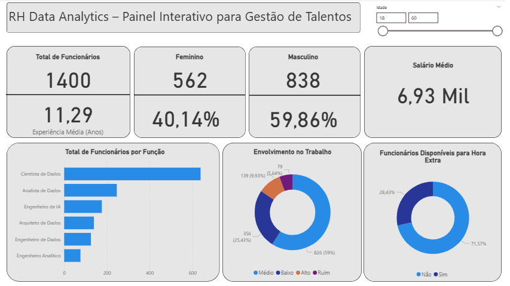

# 📊 RH Data Analytics Dashboard

## 🎯 Objetivo
Dashboard interativo desenvolvido em Power BI para análise estratégica de dados de recursos humanos, proporcionando insights acionáveis para tomada de decisões na gestão de talentos.

### Estrutura dos Dados
```
- Id_Funcionario: Identificador único
- Dados Demográficos: Idade, Gênero, Estado Civil
- Informações Organizacionais: Departamento, Função, Anos na Empresa
- Métricas de Engagement: Índice de Envolvimento, Satisfação no Trabalho
- Dados Financeiros: Salário Mensal, Valor Diária, Percentual Último Aumento
- Histórico Profissional: Anos Experiência, Número Empresas Anteriores
- Desenvolvimento: Número Treinamentos, Anos Desde Última Promoção
```

## 🛠️ Tecnologias Utilizadas
- **Power BI Desktop**: Desenvolvimento do dashboard
- **DAX**: Linguagem para criação de medidas calculadas
- **Power Query**: ETL e transformação de dados

## 📊 Principais Métricas DAX

### Métricas Demográficas
```dax
% Feminino = DIVIDE([TotalFeminino], [Total de Funcionários]) * 100
% Masculino = DIVIDE([TotalMasculino], [Total de Funcionários]) * 100
TotalFeminino = CALCULATE(COUNT(DatasetRH[Id_Funcionario]), DatasetRH[Genero] = "Feminino")
```

### Métricas Salariais
```dax
SalarioMedio = AVERAGE(DatasetRH[Salario_Mensal])
```

### Métricas de Performance
```dax
% Promover = DIVIDE([TotalFuncPromover], [Total de Funcionários]) * 100
% Nao Promover = DIVIDE([TotalFuncNaoPromover], [Total de Funcionários]) * 100
```


## 🔍 Principais Insights  

### 👥 Distribuição de Funcionários  
- **Total de Funcionários:** **1.400**  
- **Feminino:** 562 colaboradoras (**40,14%**)  
- **Masculino:** 838 colaboradores (**59,86%**)  

➡️ Observa-se um **predomínio masculino** na força de trabalho, o que pode indicar a necessidade de ações voltadas para **diversidade e inclusão**.  

---

### 💰 Remuneração e Experiência  
- **Salário Médio:** R$ **6,93 mil**  
- **Experiência Média:** **11,29 anos**  

➡️ O quadro de funcionários apresenta **alta experiência média**, sugerindo um time consolidado e com **forte conhecimento acumulado**.  
➡️ O salário médio está dentro da faixa de cargos técnicos e especializados, como **dados e tecnologia**.  

---

### 🧑‍💻 Distribuição por Função  
- **Cientista de Dados** é a função com maior número de profissionais, ultrapassando **600 colaboradores**.  
- Funções como **Analista de Dados** e **Engenheiro de IA** aparecem em seguida, com proporção significativamente menor.  

➡️ O foco organizacional está em **Ciência de Dados**, evidenciando grande investimento nessa área.  

---

### 📈 Envolvimento no Trabalho  
- **59%** dos funcionários apresentam **nível médio de engajamento**.  
- **25,4%** têm **baixo engajamento**.  
- **9,93%** já demonstram **alto engajamento**, enquanto **5,64%** se encontram em situação crítica (ruim).  

➡️ O alto percentual em nível **médio/baixo de engajamento** pode ser um **risco para retenção de talentos** e impacto na produtividade.  
➡️ A empresa deve considerar **estratégias de motivação e reconhecimento**.  

---

### ⏱️ Disponibilidade para Hora Extra  
- **71,57%** dos funcionários estão **disponíveis para hora extra**.  
- **28,43%** não estão disponíveis.  

➡️ Existe **alta flexibilidade operacional** para demandas adicionais, porém deve-se monitorar para **evitar sobrecarga** e impacto no bem-estar.  

---

## 📌 Conclusões Estratégicas  
1. **Diversidade de gênero**: há espaço para maior equilíbrio entre colaboradores masculinos e femininos.  
2. **Engajamento**: foco urgente em aumentar o nível de satisfação e envolvimento dos funcionários.  
3. **Força técnica consolidada**: predominância de **Cientistas de Dados** indica forte investimento em tecnologia e análise de dados.  
4. **Gestão de carga horária**: apesar da alta disponibilidade para horas extras, é importante balancear para **não comprometer o engajamento**.  

---

📷 **Exemplo do Dashboard:**  

  

## 🚀 Funcionalidades Implementadas

### Interatividade
- ✅ Filtros dinâmicos por idade
- ✅ Segmentação interativa entre visualizações
- ✅ Cards responsivos com KPIs principais

### Design
- ✅ Interface clean e profissional
- ✅ Paleta de cores consistente (azul/laranja)
- ✅ Layout responsivo
- ✅ Tipografia legível


## 📊 Expansões Futuras

### Análises Adicionais
- [ ] Análise de turnover por departamento
- [ ] Modelo preditivo de retenção
- [ ] Benchmarking salarial por mercado
- [ ] Dashboard de performance individual

### Melhorias Técnicas
- [ ] Implementar gateway para atualizações automáticas
- [ ] Criar versão mobile-friendly
- [ ] Adicionar alertas automáticos
- [ ] Integração com sistemas de RH


## 📄 Licença
Este projeto está sob licença MIT. Veja o arquivo [LICENSE](LICENSE) para mais detalhes.

## 📧 Contato
**LinkedIn** - [](https://linkedin.com/in/nathannysoares)


## 🎓 Créditos
Este projeto foi desenvolvido com base nos conhecimentos adquiridos no curso de Power BI **Data Science Academy (DSA)**

---
⭐ **Se este projeto foi útil para você, deixe uma star no repositório!**
